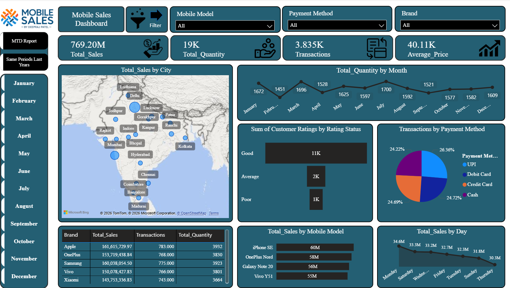

# 📱 Mobile Sales Dashboard — Power BI

<p align="center">
  
</p>

<p align="center">
  
  
  
  
</p>

---

## 📊 Overview

A comprehensive **Mobile Sales Analytics Dashboard** built in Power BI, designed to track and analyze mobile phone sales performance across Indian cities. The dashboard enables business stakeholders to monitor real-time sales KPIs, identify trends across brands and models, and compare performance with previous periods — all in a single interactive report.

> **Last Saved:** 20/12/2025 | **Author:** Deepraj Patel

---

## 🗂️ Report Pages

### 1. 🏠 Dashboard (Main Overview)
The primary landing page with high-level KPIs and interactive visuals:

| Visual | Description |
|--------|-------------|
| 📍 Map – Total Sales by City | Geographic distribution of sales across Indian cities (Delhi, Mumbai, Bangalore, Hyderabad, etc.) |
| 📈 Line Chart – Total Quantity by Month | Monthly trend of units sold across the year |
| ⭐ Bar Chart – Customer Ratings | Breakdown of Good / Average / Poor customer ratings |
| 🍩 Pie Chart – Transactions by Payment Method | UPI, Debit Card, Credit Card, and Cash split |
| 📋 Table – Brand Performance | Apple, OnePlus, Samsung, Vivo, Xiaomi — Sales, Transactions, Quantity |
| 📊 Bar Chart – Total Sales by Mobile Model | Top models: iPhone SE, OnePlus Nord, Galaxy Note 20, Vivo Y51 |
| 📅 Bar Chart – Total Sales by Day | Sales distribution across weekdays |

**KPI Cards:**
- 💰 **Total Sales:** ₹769.20M
- 📦 **Total Quantity:** 19,150 units
- 🔁 **Transactions:** 3,835
- 💵 **Average Price:** ₹40.11K

**Filters Available:**
- Mobile Model
- Payment Method
- Brand
- Month (January – December)

---

### 2. 📅 MTD Report (Month-to-Date)
Provides a focused view of current month performance against targets and prior periods, helping teams stay on track throughout the month.

---

### 3. 🔄 Same Periods Last Years
Year-over-year comparison report enabling analysis of growth trends by comparing the same time windows across multiple years — ideal for identifying seasonal patterns and long-term business trajectory.

---

## 🧩 Data Model

```
Calendar_Table
    └── Date (PK)
    └── Month, Quarter, Year, Weekday ...

Sales_data
    └── Transaction_ID (PK)
    └── Date (FK → Calendar_Table)
    └── Brand, Mobile_Model, City
    └── Units_Sold, Sale_Amount, Payment_Method
    └── Customer_Rating
```

---

## 🔧 Features & Techniques

- ✅ **DAX Measures** — Total Sales, Total Quantity, Transactions, Average Price, MTD, YoY
- ✅ **Time Intelligence** — MTD, Same Period Last Year (SPLY) comparisons
- ✅ **Slicers & Cross-filtering** — Brand, Payment Method, Model, Month
- ✅ **Drill-through** — Navigate from summary to detail views
- ✅ **Conditional Formatting** — Highlight performance thresholds
- ✅ **Custom Tooltips** — Enriched hover information
- ✅ **Responsive Layout** — Optimized for desktop and tablet view

---

## 📁 Project Structure

```
mobile-sales-dashboard/
│
├── Dashboard.pbix              # Main Power BI report file
├── README.md                   # Project documentation (this file)
│
├── data/
│   └── Sales_data.xlsx         # Source data (if applicable)
│
└── screenshot/
    └── Dashboard.png           # Dashboard preview image
```

---

## 🚀 Getting Started

### Prerequisites
- [Power BI Desktop](https://powerbi.microsoft.com/desktop/) (latest version recommended)

### Steps
1. **Clone or download** this repository
   ```bash
   git clone https://github.com/your-username/mobile-sales-dashboard.git
   ```
2. **Open** `Dashboard.pbix` in Power BI Desktop
3. If prompted, **refresh the data source** and update the file path to your local `data/` folder
4. Explore the three report pages using the tabs at the bottom

---

## 📌 Key Insights (Sample)

- 📍 **Delhi & Mumbai** are the top-performing cities by sales volume
- 🍎 **Apple** leads in Total Sales value; **OnePlus** follows closely
- 📲 **iPhone SE** is the best-selling model by revenue
- 💳 Payment methods are nearly evenly split — **UPI leads at ~26.36%**
- ⭐ Majority of customers rated their experience as **"Good" (11K ratings)**
- 📅 **Monday** records the highest single-day sales

---

## 🛠️ Tools Used

| Tool | Purpose |
|------|---------|
| Power BI Desktop | Report development & visualization |
| DAX | Calculated measures & KPIs |
| Power Query (M) | Data transformation & cleaning |
| Microsoft Excel | Source data |

---

## 👤 Author

**Deepraj Patel**
- GitHub: [@your-username](https://github.com/your-username)
- LinkedIn: [linkedin.com/in/your-profile](https://linkedin.com/in/your-profile)

---

## 📄 License

This project is licensed under the [MIT License](LICENSE).

---

> ⭐ If you found this helpful, please consider giving the repo a star!
